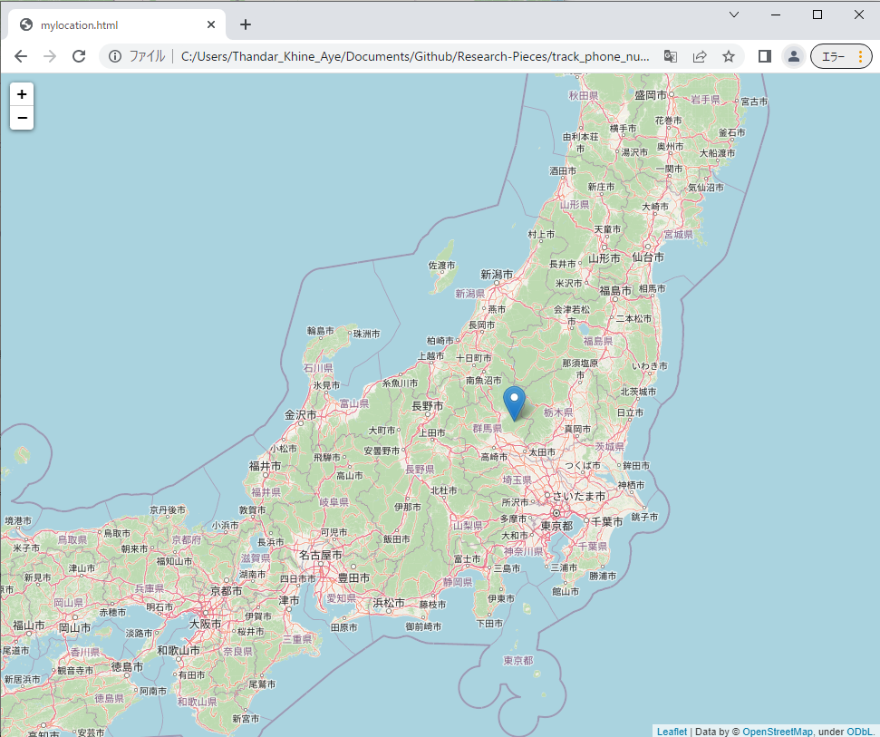

# Track Phone number Location
Learning to track Phone number Location using Python.   
Open VSCode and create a project titled.   
Then, open the terminal and type the below-listed commands to install the respective libraries.  
```
pip install phonenumbers
pip install opencage
pip install folium
```
Run the python file.
Enter the phone number which you want to track.

Output:
1. after running finished, will export HTML file
 

2. run the HTML file, checkout the tracking result with map
 

Reference:
https://www.youtube.com/watch?v=Geisa_ib5hs